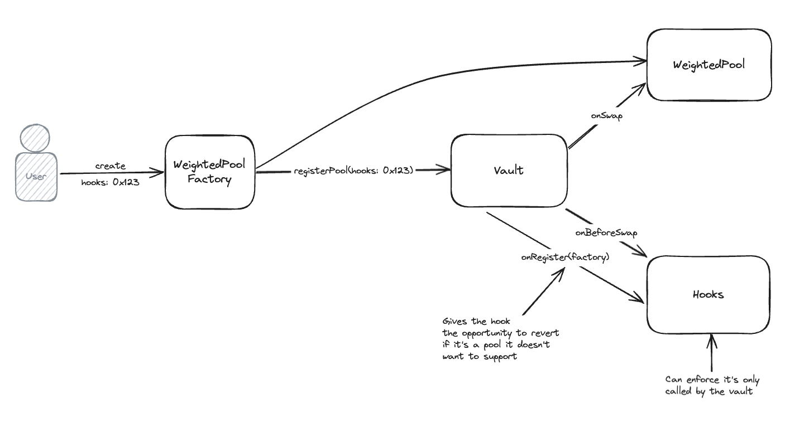

# Awesome Balancer v3 Hooks

A curated list of awesome [hooks](https://docs-v3.balancer.fi/concepts/core-concepts/hooks.html) resources with hardhat examples.

## 🤔 Introduction

Balancer v3 Hooks -- also known simply as hooks -- are specially designed contracts that run at distinct points throughout a pool action's lifecycle. They serve as plugins allowing developers to tailor how pools, swaps, fees, and LP positions interact. This enables innovation atop Uniswap v4's core features, thereby supporting the development of custom AMM pools.

_These resources will help you get started with Balancer v3 hooks._

- [Developer Documents](https://docs-v3.balancer.fi/concepts/core-concepts/hooks.html): Official Developer Documents from Balancer.Fi Foundation, covering topics including how developer would begin to start building out hooks on local testnets in order to start testing out hook designs.
- [Core smart contracts of Uniswap v4](https://github.com/balancer/balancer-v3-monorepo): The core smart contracts of Balancer v3, the management of all pool state in `Vault.sol`, and use of hook contracts to implement callbacks in the lifecycle of pool actions.

## 🔄 Lifecycle

During the course of a pool action's lifecycle, a hook invokes custom logic primarily at four critical phases:

1. **Initialize**: Activated when the pool is deployed.
2. **Modify Position**: Used to add or remove liquidity.
3. **Swap**: Engages a swap between tokens within the V3 ecosystem.
4. **Dynamic Swap Fee**: Customize swap fee allowing pools to adjust their fees up or down

- `shouldCall{Before,After}Initialize`
- `shouldCall{Before,After}AddLiquidity`
- `shouldCall{Before,After}RemoveLiquidity`
- `shouldCall{Before,After}Swap`
- `shouldCallComputeDynamicSwapFee`

Moreover, hooks can determine fees on swaps and liquidity withdrawals through callback functions. The flexibility lies in updating the fee values or callback logic based on the hook's design. Nevertheless, the callbacks activated on a pool, including the fee type, remain constant post pool initialization.



## 🔧 Functionalities

_Hooks foster creativity. Here are some interesting functionalities that could be implemented with hooks._

- Onchain limit orders that fill at tick prices
- Dynamic fees rooted in volatility or other determinants
- Channeling out-of-range liquidity into lending platforms
- Autocompounding LP fees reintegrated into the LP positions
- MEV profits being internally distributed back to liquidity providers
- A time-weighted average market maker TWAMM to execute large orders over time
- Creation of bespoke onchain oracles (i.e., median, truncated), like geomean oracles

## 📜 Examples

_This repository contains a collection of hooks - Feel free to use it in your own project_

- [Membership Hook](contracts/MembershipHook.sol): A hook to provide discounted swap fees for high volume traders and NFT membership holders.

## 🎬 How to start

Try running some of the following tasks:

```shell
npx hardhat help
npx hardhat test
REPORT_GAS=true npx hardhat test
npx hardhat node
npx hardhat run --network sepolia scripts/membership/1-deploy.ts
```
